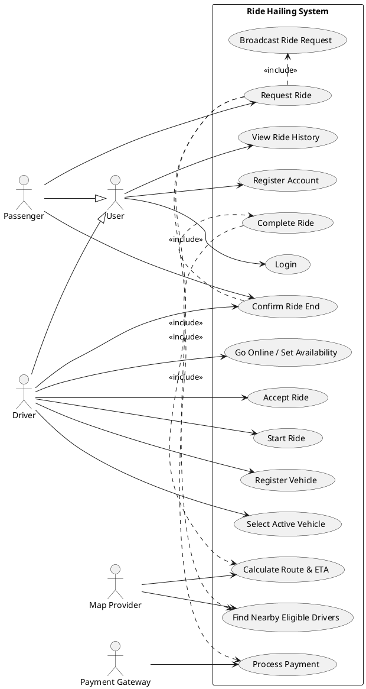

## Regenerated Use Case Diagram

## Notes

- `Passenger` and `Driver` are specialized actors that inherit shared behavior from `User`.
- Shared use cases: registration, login, and ride history.
- Passenger-specific and driver-specific actions remain separate.
